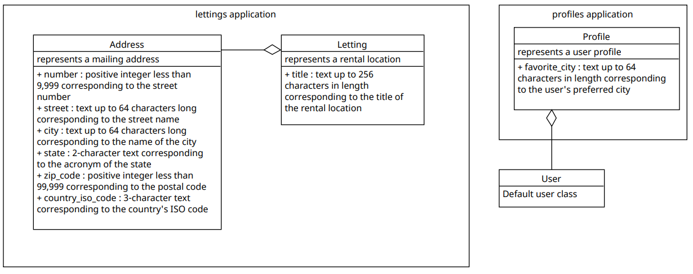

========
Database
========

The data is stored on a SQLite3 database included in the Django project container.
Here are some steps to check that the database is working properly.

- Open a sqlite3 shell session
- connect to the database with: .open oc-lettings-site.sqlite3
- view tables in the database: .tables
- show columns in the profiles table: pragma table_info(profiles_profile);
- query the profile table: select user_id, favorite_city from profiles_profile where favorite_city like 'B%';
- .quit to exit

Models
------

The project is broken down into 2 applications: lettings and profiles.
Here is the description of the models and the links between the different classes.

