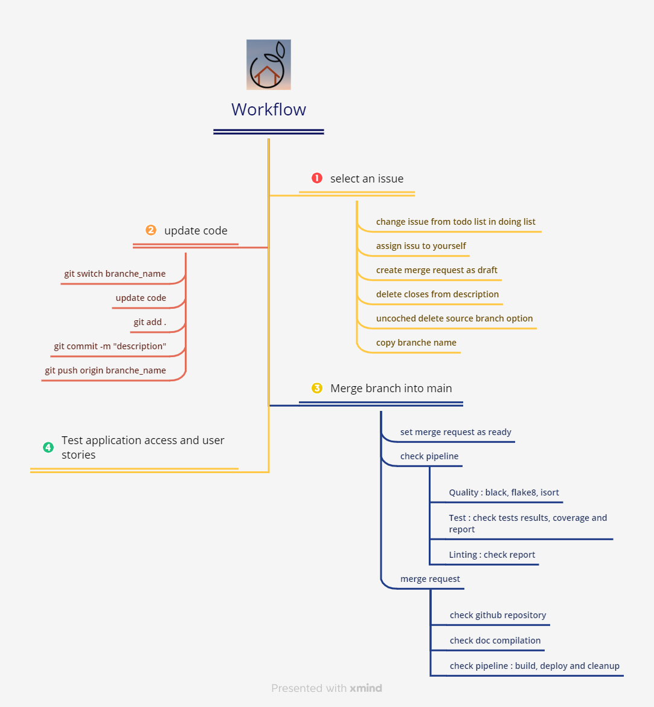

==================
deployment Process
==================

This project is managed by gitlab : https://gitlab.com/slb591/lettings

workflow description
--------------------

The diagram below describes the steps for modifying and deploying a modification.

versionning
-----------

- when a merge request is created, a development branch is generated with the name of the issue
- next the branch is merged in the main branch
- then the main branch can be merged in a stable version

pipeline
--------

- on commit,
	- the files are updated in gitlab and github
	- a first check is running for quality
	- then test and linting are executed
	- then the pipeline check if tests are 80% coverage

- on merge request into main branch,
	- the latest version of documentation is updating
	- then complete build is generated
	- the deployement is running on docker hub and render

- on merge request into a stable branch,
	- the stable version of documentation is updating
	- the deployement is running on docker hub and render