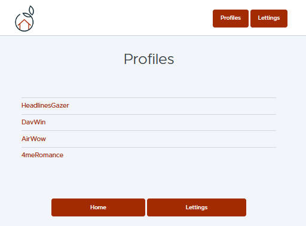

=======================
Application Description
=======================

When you run the application locally with command python manage.py runserver, you go to http://localhost:8000 to access home page.

-----

then you can access the lettings list:

-----

and select one to show the address:

-----

then you can go back home and inspect the profiles list:

-----

and look at a profile data:

.. image:: images/profilepage.png
   :alt: home page